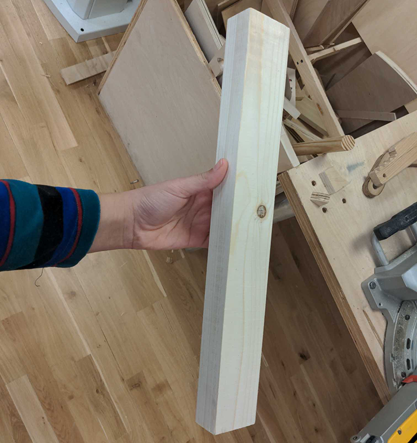
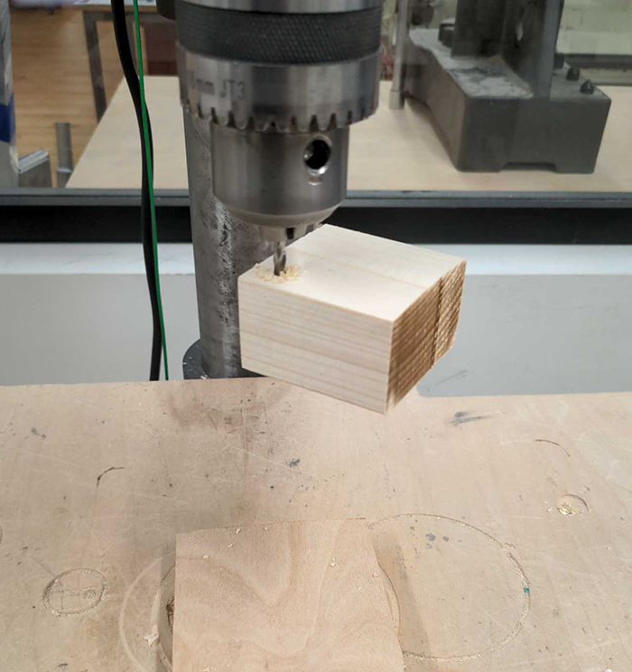
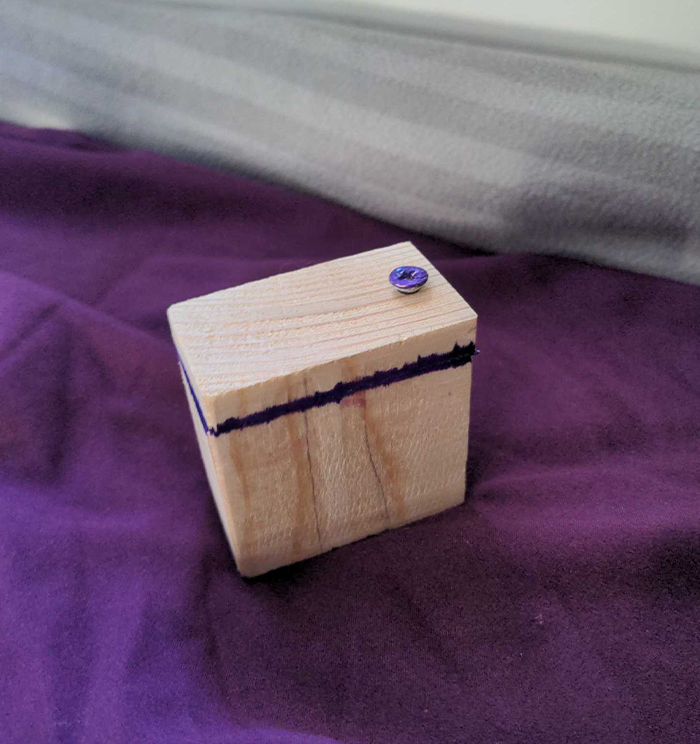
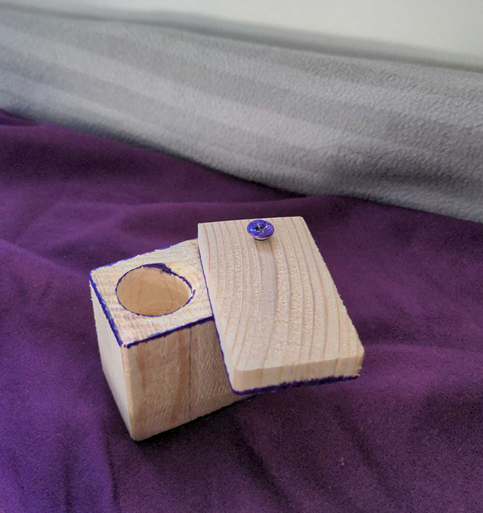

**How I made my first little box
**

First I went ahead and selected a piece of wood to start from. I went with this long piece from the scrap bin, it might even be the same piece used in class for the demo.

  
 
 
 
 Next, after turning on the dust collecter thing, I went ahead and sanded all sides of the piece on one end. 
 
 Then I measures the piece out and marked where I could cut it to make a perfect square. 
 
 After that I cut it with the circular saw before taking it to the drill press where this occured. 
 
 
 
  

 I stop the drill press immediatley and just moved on because I though it had gone in enough. After cutting a bit of bit of wood off of the side off to make a lid using the belt saw I realized that the drill bit had not gone in deep enough to extent beyond where I cut the lid. So I decided to start all over again. 
 
 I repeated everything above again (except the measuring and cutting to square moment). When I got to the drill press I was able to get a bit more progress, I think because I had adjusted the height and moved a little quicker but because their was no clamp the piece of wood stuck to the drill bit and spun around, I again stopped the drill press and just moved on to the belt saw where I cut the lid just right to have a hold from the press present on both pieces.
 
 I returned to the press to make use of one of those big bits from the drawer. Immediatley it was clear that without a clamp I was gonna get nowhere so I consulted the shop staff on duty who suggessted using the big bit in a hand drill with the table clamp. While this process took a bit more force and time it seemed to have a similar effect (although the hole is a little oval-like). I then tried inserting a screw with the hand dril but as always it got crooked so I undid it with a screwdriver and was able to put it in more straight using that tool. Lastly, I went a little silly and started to color over accent lines with a purple sharpie but the ink spread within the wood grains which I am not very happy with. 
 
  
 
 
 

 
 I had to leave town last minute to deal with a family situation but if I have time when I return I want to try decorating it with other materials and try to make another box using this piece of wood I cut from a bigger cylinder piece in the scrap bin. 
